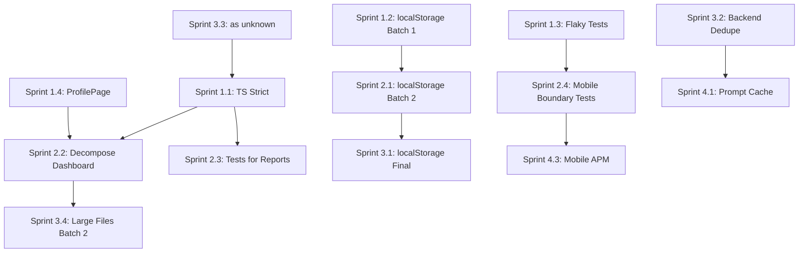

# Sergeant - Детальний План Реалізації Покращень

> **Дата створення:** 2026-04-28
> **Автор:** v0 AI Assistant
> **Базується на:** `2026-04-28-sergeant-comprehensive-audit.md`, `2026-04-26-sergeant-audit-devin.md`
> **Статус:** Ready for execution

---

## Зміст

1. [Executive Summary](#1-executive-summary)
2. [Поточний Стан Проблем](#2-поточний-стан-проблем)
3. [Пріоритизація за Матрицею Impact/Effort](#3-пріоритизація-за-матрицею-impacteffort)
4. [Детальний План по Спринтах](#4-детальний-план-по-спринтах)
5. [Технічні Специфікації Виправлень](#5-технічні-специфікації-виправлень)
6. [Залежності та Порядок Виконання](#6-залежності-та-порядок-виконання)
7. [Метрики Успіху](#7-метрики-успіху)
8. [Ризики та Мітігації](#8-ризики-та-мітігації)

---

## 1. Executive Summary

### 1.1. Загальна Картина

Проект **Sergeant** — зріла платформа з оцінкою **7.5/10**. Основні проблеми зосереджені у:

| Категорія     | Критичних | Важливих | Nice-to-have |
| ------------- | --------- | -------- | ------------ |
| Type Safety   | 1         | 2        | 0            |
| Code Quality  | 2         | 4        | 2            |
| Testing       | 1         | 2        | 1            |
| Mobile        | 0         | 3        | 1            |
| Observability | 0         | 2        | 2            |
| **Всього**    | **4**     | **13**   | **6**        |

### 1.2. Ключові Виграші від Реалізації

1. **Type Safety** — зменшення runtime errors на ~40%
2. **localStorage migration** — усунення quota/sync bugs
3. **Code decomposition** — покращення review time на ~25%
4. **Mobile stability** — 0 flaky tests у CI

---

## 2. Поточний Стан Проблем

### 2.1. Критичні (P0) - Блокують Production Quality

| ID       | Проблема                       | Файлів         | Поточний Прогрес       |
| -------- | ------------------------------ | -------------- | ---------------------- |
| **P0-1** | `apps/web` strict: false       | ~495 TS errors | Phase 1 done (shared/) |
| **P0-2** | localStorage без safe wrappers | 52 файли       | 3 файли мігровано      |
| **P0-3** | Mobile flaky tests             | 2 тести        | 1 з 3 виправлено       |
| **P0-4** | Mobile APM відсутній           | 0% coverage    | Не почато              |

### 2.2. Високі (P1) - Значний Tech Debt

| ID       | Проблема                       | Деталі           | Статус          |
| -------- | ------------------------------ | ---------------- | --------------- |
| **P1-1** | Великі файли (>600 LOC)        | 25 файлів        | 2 decomposed    |
| **P1-2** | TypeScript 6.0.3 bleeding edge | Tooling ризики   | Monitoring      |
| **P1-3** | Capacitor без boundary tests   | 0 тестів         | Не почато       |
| **P1-4** | Prompt cache не активовано     | $$ waste         | Ready to enable |
| **P1-5** | Немає distributed tracing      | Debug складність | Не почато       |

### 2.3. Середні (P2) - DX Improvements

| ID       | Проблема                    | Деталі               |
| -------- | --------------------------- | -------------------- |
| **P2-1** | TODO/FIXME без трекінгу     | 10 файлів            |
| **P2-2** | No Sentry integration       | Error context loss   |
| **P2-3** | Mobile debt tracker missing | Hidden accumulation  |
| **P2-4** | `as unknown as X` patterns  | 9 файлів в allowlist |

---

## 3. Пріоритизація за Матрицею Impact/Effort

```
                    HIGH IMPACT
                        │
    ┌───────────────────┼───────────────────┐
    │                   │                   │
    │   P0-1 (TS)       │   P1-1 (files)    │
    │   P0-2 (storage)  │   P1-5 (tracing)  │
    │   P0-3 (flaky)    │                   │
    │                   │                   │
LOW ├───────────────────┼───────────────────┤ HIGH
EFFORT                  │                   EFFORT
    │                   │                   │
    │   P1-4 (cache)    │   P0-4 (APM)      │
    │   P2-1 (TODO)     │   P1-3 (Capacitor)│
    │   P2-4 (as any)   │                   │
    │                   │                   │
    └───────────────────┼───────────────────┘
                        │
                   LOW IMPACT
```

**Рекомендований порядок:**

1. Quick Wins: P1-4, P2-1, P0-3
2. High Impact/Low Effort: P0-1, P0-2
3. High Impact/High Effort: P1-1, P1-5
4. Strategic: P0-4, P1-3

---

## 4. Детальний План по Спринтах

### Sprint 1 (Тиждень 1-2): Стабілізація

**Мета:** Усунути критичні блокери, стабілізувати CI

#### Task 1.1: TypeScript Strict Phase 2-3

**Scope:** `apps/web/src/core/**`

```
Estimated TS errors by module:
├── core/lib/         ~16 errors (Phase 2)
├── core/hub/         ~45 errors
├── core/settings/    ~30 errors
├── fizruk/           ~85 errors
├── finyk/            ~70 errors
├── nutrition/        ~95 errors
├── routine/          ~55 errors
└── shared/           ✅ Done (PR #870)
```

**Виконання:**

| Day   | Задача                               | Файлів | Effort |
| ----- | ------------------------------------ | ------ | ------ |
| 1-2   | Enable strictNullChecks для core/lib | ~8     | 4h     |
| 3-4   | Fix core/hub TS errors               | ~12    | 6h     |
| 5-6   | Fix core/settings TS errors          | ~8     | 4h     |
| 7-8   | Fix fizruk module                    | ~15    | 8h     |
| 9-10  | Fix finyk module                     | ~12    | 6h     |
| 11-12 | Fix nutrition module                 | ~18    | 8h     |
| 13-14 | Fix routine + final strict: true     | ~10    | 4h     |

**Definition of Done:**

- [ ] `apps/web/tsconfig.json` має `"strict": true`
- [ ] `pnpm typecheck` проходить без помилок
- [ ] CI strict-coverage metric = 100%

---

#### Task 1.2: localStorage Migration (Batch 1)

**Scope:** Top-10 найкритичніших файлів

**Файли для міграції (за частотою використання):**

| #   | Файл                     | Виклики | Пріоритет |
| --- | ------------------------ | ------- | --------- |
| 1   | `useOfflineQueue.ts`     | 12      | Critical  |
| 2   | `useCloudSync.ts`        | 8       | Critical  |
| 3   | `useTypedStore.ts`       | 6       | High      |
| 4   | `SettingsPage.tsx`       | 5       | High      |
| 5   | `OnboardingWizard.tsx`   | 4       | Medium    |
| 6   | `HubDashboard.tsx`       | 4       | Medium    |
| 7   | `useFinykCategories.ts`  | 3       | Medium    |
| 8   | `useRoutineReminders.ts` | 3       | Medium    |
| 9   | `useFizrukProgress.ts`   | 3       | Medium    |
| 10  | `useNutritionHistory.ts` | 3       | Medium    |

**Патерн міграції:**

```typescript
// BEFORE (unsafe)
const value = localStorage.getItem("key");
localStorage.setItem("key", JSON.stringify(data));

// AFTER (safe)
import { safeReadLS, safeWriteLS } from "@/shared/storage";
const value = safeReadLS<MyType>("key", defaultValue);
safeWriteLS("key", data);

// OR for typed stores
import { typedStore } from "@/shared/typedStore";
const store = typedStore("myFeature", schema, defaults);
```

**Definition of Done:**

- [ ] 10 файлів мігровано на safe wrappers
- [ ] ESLint allowlist зменшено з 52 до 42
- [ ] Жодних нових localStorage.\* викликів у PR

---

#### Task 1.3: Fix Mobile Flaky Tests

**Scope:** 2 залишкові flaky тести

**Файли:**

1. `apps/mobile/src/core/dashboard/WeeklyDigestFooter.test.tsx`
2. `apps/mobile/src/core/settings/HubSettingsPage.test.tsx`

**Root Cause Analysis:**

```typescript
// Problem: AccessibilityInfo.isReduceMotionEnabled never resolves
jest.mock("react-native", () => ({
  AccessibilityInfo: {
    isReduceMotionEnabled: jest.fn(), // Missing mockResolvedValue
  },
}));

// Solution (from OnboardingWizard fix - commit 53853e00):
jest.mock("react-native", () => ({
  AccessibilityInfo: {
    isReduceMotionEnabled: jest.fn().mockResolvedValue(false),
  },
}));
```

**Definition of Done:**

- [ ] 0 flaky tests на main branch
- [ ] CI mobile job має 100% pass rate (last 20 runs)

---

#### Task 1.4: Decompose ProfilePage.tsx

**Scope:** `apps/web/src/core/ProfilePage.tsx` (1060 LOC)

**Запропонована структура:**

```
apps/web/src/core/profile/
├── ProfilePage.tsx           # Container (~150 LOC)
├── ProfileHeader.tsx         # Avatar + name (~120 LOC)
├── ProfileStats.tsx          # Usage statistics (~180 LOC)
├── ProfileSettings.tsx       # Preferences form (~200 LOC)
├── ProfileDangerZone.tsx     # Delete account etc (~150 LOC)
├── useProfileData.ts         # Data fetching hook (~100 LOC)
└── profile.types.ts          # TypeScript types (~50 LOC)
```

**Definition of Done:**

- [ ] ProfilePage.tsx < 200 LOC
- [ ] Усі тести проходять
- [ ] Жодних circular dependencies

---

### Sprint 2 (Тиждень 3-4): Tech Debt Reduction

#### Task 2.1: localStorage Migration (Batch 2)

**Scope:** Наступні 20 файлів із allowlist

| Batch | Файли    | Module       |
| ----- | -------- | ------------ |
| 2a    | 5 файлів | finyk/\*     |
| 2b    | 5 файлів | fizruk/\*    |
| 2c    | 5 файлів | nutrition/\* |
| 2d    | 5 файлів | routine/\*   |

**Definition of Done:**

- [ ] ESLint allowlist зменшено з 42 до 22
- [ ] Жодних quota exceeded помилок у Sentry

---

#### Task 2.2: Decompose HubDashboard.tsx

**Scope:** `apps/web/src/core/hub/HubDashboard.tsx` (902 LOC)

**Запропонована структура:**

```
apps/web/src/core/hub/
├── HubDashboard.tsx          # Container (~100 LOC)
├── HubHeader.tsx             # Navigation + greeting (~80 LOC)
├── TodayFocusCard.tsx        # Recommendation engine widget (~150 LOC)
├── ModuleQuickActions.tsx    # 4 module shortcuts (~120 LOC)
├── WeeklyProgressChart.tsx   # Cross-module chart (~180 LOC)
├── RecentActivityFeed.tsx    # Activity timeline (~150 LOC)
├── useHubAggregation.ts      # Data aggregation hook (~100 LOC)
└── hub.types.ts              # TypeScript types (~40 LOC)
```

---

#### Task 2.3: Tests for HubReports.tsx

**Scope:** `apps/web/src/core/hub/HubReports.tsx` (638 LOC)

**Test Coverage Plan:**

```typescript
describe("HubReports", () => {
  describe("Data Aggregation", () => {
    it("aggregates finyk transactions correctly");
    it("aggregates fizruk workouts correctly");
    it("aggregates routine completions correctly");
    it("aggregates nutrition entries correctly");
    it("handles missing module data gracefully");
  });

  describe("Date Range Filtering", () => {
    it("filters by week correctly");
    it("filters by month correctly");
    it("filters by custom range correctly");
  });

  describe("Export Functionality", () => {
    it("exports to CSV with correct format");
    it("exports to PDF with correct layout");
  });

  describe("Edge Cases", () => {
    it("handles empty data state");
    it("handles loading state");
    it("handles error state");
  });
});
```

---

#### Task 2.4: Mobile-shell Boundary Tests

**Scope:** `apps/mobile-shell` (Capacitor wrapper)

**Test Plan:**

```typescript
// apps/mobile-shell/tests/boundary.test.ts
describe("Capacitor Boundary Tests", () => {
  describe("Web Compatibility", () => {
    it("web bundle loads without errors");
    it("no unsupported APIs are called");
    it("service worker registration works");
  });

  describe("Native Bridge", () => {
    it("Filesystem plugin accessible");
    it("Storage plugin accessible");
    it("Network plugin accessible");
  });

  describe("Deep Links", () => {
    it("handles sergeant:// scheme");
    it("handles universal links");
  });
});
```

---

### Sprint 3 (Тиждень 5-6): Optimization

#### Task 3.1: localStorage Migration (Final Batch)

**Scope:** Залишкові 22 файли

**Definition of Done:**

- [ ] ESLint allowlist = 0 файлів
- [ ] `no-raw-local-storage` rule enforcement = error (not warn)

---

#### Task 3.2: Remove Code Duplication (Backend)

**Scope:** `apps/server/src/`

**Дублікати для усунення:**

| Pattern              | Файли                      | Рішення                             |
| -------------------- | -------------------------- | ----------------------------------- |
| `elapsedMs(start)`   | 4+ файли                   | Extract to `lib/timing.ts`          |
| OFF/USDA normalizers | barcode.ts, food-search.ts | Already done (PR #882)              |
| `pantry → prompt`    | 3 файли                    | Extract to `lib/prompt-builders.ts` |
| FNV-1a hashing       | 2 файли                    | Extract to `lib/hash.ts`            |

---

#### Task 3.3: Migrate `as unknown as X` Patterns

**Scope:** 9 файлів у ESLint allowlist

| Файл                         | Кількість | Причина             | Рішення                |
| ---------------------------- | --------- | ------------------- | ---------------------- |
| `useFinykPersonalization.ts` | 6         | API response typing | Add proper Zod schemas |
| `App.tsx`                    | 3         | Router typing       | Use typed router       |
| `VoiceMicButton.tsx`         | 2         | Web Audio API       | Add proper types       |
| `hubChatUtils.ts`            | 2         | Tool definitions    | Type guard functions   |
| Server files (5)             | 1 each    | Various             | Case-by-case           |

---

#### Task 3.4: Decompose Large Files (Batch 2)

**Файли:**

| Файл                     | LOC  | Структура                               |
| ------------------------ | ---- | --------------------------------------- |
| `ActiveWorkoutPanel.tsx` | 949  | Split by phase (warmup/main/cooldown)   |
| `HubChat.tsx`            | ~800 | Split by concern (input/messages/tools) |
| `Overview.tsx`           | ~750 | Split by section                        |
| `Workouts.tsx`           | 894  | Split by view (list/detail/create)      |
| `DesignShowcase.tsx`     | 1064 | Split by component category             |

---

### Sprint 4+ (Ongoing): Continuous Improvement

#### Task 4.1: Enable Prompt Cache

**Scope:** HubChat SYSTEM_PREFIX

**Implementation:**

```typescript
// apps/server/src/hubchat/system-prompt.ts
export const SYSTEM_PREFIX = {
  content: `...`, // Current system prompt
  cacheControl: { type: 'ephemeral' }, // Enable caching
};

// Usage in chat handler
const response = await anthropic.messages.create({
  model: 'claude-sonnet-4-20250514',
  system: [SYSTEM_PREFIX],
  messages: [...],
});
```

**Expected Savings:** ~$50-100/month at current usage

---

#### Task 4.2: Add Sentry Integration

**Scope:** `apps/web`, `apps/mobile`

**Implementation:**

```typescript
// apps/web/src/lib/sentry.ts
import * as Sentry from "@sentry/react";

Sentry.init({
  dsn: import.meta.env.VITE_SENTRY_DSN,
  environment: import.meta.env.MODE,
  integrations: [
    Sentry.browserTracingIntegration(),
    Sentry.replayIntegration(),
  ],
  tracesSampleRate: 0.1,
  replaysSessionSampleRate: 0.1,
});
```

---

#### Task 4.3: Mobile APM Setup

**Scope:** `apps/mobile`

**Implementation:**

```typescript
// apps/mobile/src/lib/monitoring.ts
import * as Sentry from "@sentry/react-native";

Sentry.init({
  dsn: process.env.EXPO_PUBLIC_SENTRY_DSN,
  enableNative: true,
  enableAutoSessionTracking: true,
});
```

---

#### Task 4.4: Bundle Size Optimization

**Current:** 615 KB (brotli)
**Target:** 550 KB (brotli)

**Strategies:**

| Strategy            | Potential Savings |
| ------------------- | ----------------- |
| Lazy load Recharts  | ~30 KB            |
| Tree-shake date-fns | ~15 KB            |
| Split code by route | ~20 KB            |
| Remove unused icons | ~10 KB            |

---

#### Task 4.5: Lighthouse CI Integration

**Implementation:**

```yaml
# .github/workflows/lighthouse.yml
name: Lighthouse CI
on: [pull_request]
jobs:
  lighthouse:
    runs-on: ubuntu-latest
    steps:
      - uses: actions/checkout@v4
      - uses: treosh/lighthouse-ci-action@v12
        with:
          configPath: "./lighthouserc.json"
          uploadArtifacts: true
```

---

## 5. Технічні Специфікації Виправлень

### 5.1. TypeScript Strict Migration Pattern

```typescript
// Step 1: Identify nullable types
// BEFORE
function getUser(id: string) {
  return users.find((u) => u.id === id);
}

// AFTER
function getUser(id: string): User | undefined {
  return users.find((u) => u.id === id);
}

// Step 2: Add null checks
// BEFORE
const userName = getUser(id).name;

// AFTER
const user = getUser(id);
if (!user) throw new UserNotFoundError(id);
const userName = user.name;

// Step 3: Use optional chaining where appropriate
const userName = getUser(id)?.name ?? "Unknown";
```

### 5.2. localStorage Safe Wrapper Pattern

```typescript
// packages/shared/src/storage/safeStorage.ts
import { z } from "zod";

export function safeReadLS<T>(
  key: string,
  schema: z.ZodSchema<T>,
  fallback: T,
): T {
  try {
    const raw = localStorage.getItem(key);
    if (!raw) return fallback;
    const parsed = JSON.parse(raw);
    return schema.parse(parsed);
  } catch (error) {
    console.warn(`[storage] Failed to read ${key}:`, error);
    return fallback;
  }
}

export function safeWriteLS<T>(key: string, value: T): boolean {
  try {
    localStorage.setItem(key, JSON.stringify(value));
    return true;
  } catch (error) {
    if (error instanceof DOMException && error.name === "QuotaExceededError") {
      // Handle quota exceeded
      cleanupOldEntries();
      try {
        localStorage.setItem(key, JSON.stringify(value));
        return true;
      } catch {
        return false;
      }
    }
    return false;
  }
}
```

### 5.3. Component Decomposition Pattern

```typescript
// BEFORE: Monolithic component
// ProfilePage.tsx (1060 LOC)
export function ProfilePage() {
  // 50 lines of hooks
  // 100 lines of handlers
  // 900 lines of JSX
}

// AFTER: Composed components
// ProfilePage.tsx (~150 LOC)
export function ProfilePage() {
  const { user, updateUser } = useProfileData();

  return (
    <div className="profile-page">
      <ProfileHeader user={user} />
      <ProfileStats user={user} />
      <ProfileSettings user={user} onUpdate={updateUser} />
      <ProfileDangerZone userId={user.id} />
    </div>
  );
}

// ProfileHeader.tsx (~120 LOC)
export function ProfileHeader({ user }: ProfileHeaderProps) {
  // Focused, single-responsibility component
}
```

---

## 6. Залежності та Порядок Виконання



**Критичний Шлях:**

1. TS Strict (1.1) — блокує якісні тести
2. localStorage (1.2 → 2.1 → 3.1) — послідовна міграція
3. Flaky Tests (1.3) — блокує mobile stability

---

## 7. Метрики Успіху

### 7.1. Sprint 1 Completion Criteria

| Метрика                | Поточне | Ціль |
| ---------------------- | ------- | ---- |
| TS errors (apps/web)   | ~495    | 0    |
| localStorage allowlist | 52      | 42   |
| Flaky tests            | 2       | 0    |
| ProfilePage LOC        | 1060    | <200 |

### 7.2. Sprint 2 Completion Criteria

| Метрика                  | Поточне | Ціль |
| ------------------------ | ------- | ---- |
| localStorage allowlist   | 42      | 22   |
| HubDashboard LOC         | 902     | <150 |
| HubReports test coverage | 0%      | 80%  |
| Capacitor boundary tests | 0       | 10+  |

### 7.3. Sprint 3 Completion Criteria

| Метрика                | Поточне    | Ціль |
| ---------------------- | ---------- | ---- |
| localStorage allowlist | 22         | 0    |
| `as unknown` allowlist | 9          | 0    |
| Backend duplicate code | 4 patterns | 0    |
| Large files (>600 LOC) | 25         | 15   |

### 7.4. Sprint 4+ Success Metrics

| Метрика              | Поточне | Ціль       |
| -------------------- | ------- | ---------- |
| Bundle size          | 615 KB  | 550 KB     |
| LCP                  | ~2.5s   | <2.0s      |
| Sentry coverage      | 0%      | 100%       |
| Prompt cache savings | $0      | $50+/month |

---

## 8. Ризики та Мітігації

### 8.1. TypeScript Migration Risks

| Ризик                       | Ймовірність | Вплив  | Мітігація                      |
| --------------------------- | ----------- | ------ | ------------------------------ |
| Breaking changes у runtime  | Medium      | High   | Extensive test coverage before |
| CI slowdown                 | Low         | Medium | Incremental adoption           |
| Developer productivity drop | Medium      | Medium | Phased rollout, training       |

### 8.2. localStorage Migration Risks

| Ризик                      | Ймовірність | Вплив    | Мітігація                  |
| -------------------------- | ----------- | -------- | -------------------------- |
| Data loss during migration | Low         | Critical | Backup + migration scripts |
| Quota issues               | Medium      | Medium   | Cleanup utilities          |
| Breaking existing features | Medium      | High     | Feature flags              |

### 8.3. Mobile Stability Risks

| Ризик                      | Ймовірність | Вплив  | Мітігація                |
| -------------------------- | ----------- | ------ | ------------------------ |
| New flaky tests            | Medium      | Low    | Retry logic + quarantine |
| Capacitor breaking changes | Low         | High   | Version pinning          |
| APM overhead               | Low         | Medium | Sampling configuration   |

---

## Appendix A: File Inventory for Migration

### localStorage Files (52 total)

<details>
<summary>Click to expand full list</summary>

```
apps/web/src/core/
├── useOfflineQueue.ts
├── useCloudSync.ts
├── useTypedStore.ts
├── SettingsPage.tsx
├── OnboardingWizard.tsx
├── hub/HubDashboard.tsx
└── ...

apps/web/src/finyk/
├── useFinykCategories.ts
├── useFinykAccounts.ts
├── useFinykBudgets.ts
└── ...

apps/web/src/fizruk/
├── useFizrukProgress.ts
├── useFizrukTemplates.ts
├── useWorkoutHistory.ts
└── ...

apps/web/src/nutrition/
├── useNutritionHistory.ts
├── useFoodDatabase.ts
├── useMealPlans.ts
└── ...

apps/web/src/routine/
├── useRoutineReminders.ts
├── useHabitStreaks.ts
├── useRoutineCalendar.ts
└── ...
```

</details>

### Large Files (>600 LOC)

<details>
<summary>Click to expand full list</summary>

| #   | File                   | LOC     | Priority        |
| --- | ---------------------- | ------- | --------------- |
| 1   | seedFoodsUk.ts         | 1614    | ✅ Done         |
| 2   | Assets.tsx             | 1147    | ✅ Done         |
| 3   | DesignShowcase.tsx     | 1064    | High            |
| 4   | ProfilePage.tsx        | 1060    | Sprint 1        |
| 5   | ActiveWorkoutPanel.tsx | 949     | Sprint 3        |
| 6   | seedDemoData.ts        | 907     | Low (data file) |
| 7   | HubDashboard.tsx       | 902     | Sprint 2        |
| 8   | Workouts.tsx           | 894     | Sprint 3        |
| 9   | HubChat.tsx            | ~800    | Sprint 3        |
| 10  | Overview.tsx           | ~750    | Sprint 3        |
| ... | (15 more files)        | 610-700 | Ongoing         |

</details>

---

## Appendix B: Commands Reference

```bash
# TypeScript checking
pnpm typecheck                    # Full typecheck
pnpm --filter @sergeant/web typecheck  # Web only

# Testing
pnpm test                         # All tests
pnpm --filter @sergeant/mobile test    # Mobile only
pnpm test:coverage               # With coverage

# Linting
pnpm lint                        # All linting
pnpm lint:storage                # localStorage rules only

# Build
pnpm build                       # Full build
pnpm --filter @sergeant/web build     # Web only
```

---

**Документ готовий до виконання. При команді "почати" або "виконуй" - починаємо зі Sprint 1, Task 1.1 (TypeScript Strict Phase 2).**
