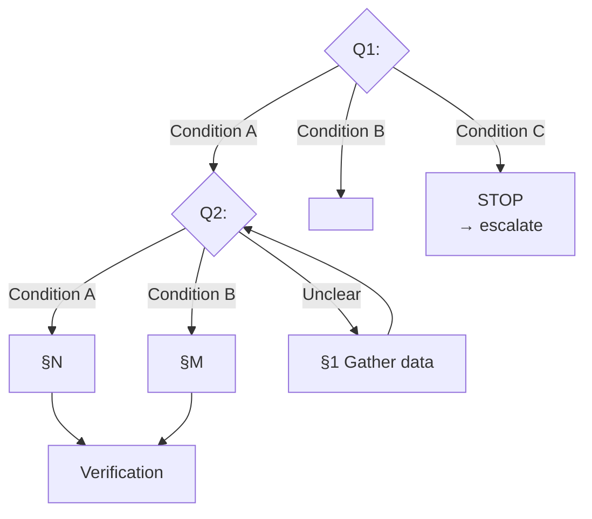

# Playbook: <Title>

**Trigger:** <When to use this playbook — symptoms, alerts, or requests that activate it.>

---

## Decision Tree

> Follow this tree from Q1 downward. Each leaf node (→ **ACTION**) links to the detailed steps below.

**Q1: <First diagnostic question>**

- <Condition A> → <action or next question>
- <Condition B> → <action or next question>
- <Condition C> → **STOP** → <escalation / alternative playbook>

**Q2: <Second diagnostic question>**

- <Condition A> → [§N <step title>](#n-step-anchor)
- <Condition B> → [§M <step title>](#m-step-anchor)
- Unclear → gather more data ([§1](#1-first-step)) → retry Q2

<!-- Add more Qn as needed. Keep each question to 2-4 branches max. -->

---

## Background (Original Steps)

<!-- Move the original detailed steps here. Preserve all h3 anchors. -->

### 1. <First step>

<Detailed instructions, commands, code snippets.>

### 2. <Second step>

<Detailed instructions.>

<!-- Continue numbering as needed. -->

---

## Verification

- [ ] <Checkpoint 1>
- [ ] <Checkpoint 2>
- [ ] <Checkpoint 3>

## Notes

- <Important caveats, gotchas, cross-references to AGENTS.md rules.>

## See also

- [AGENTS.md](../../AGENTS.md) — hard rules
- [<related-playbook>.md](<related-playbook>.md) — <when to use instead>
