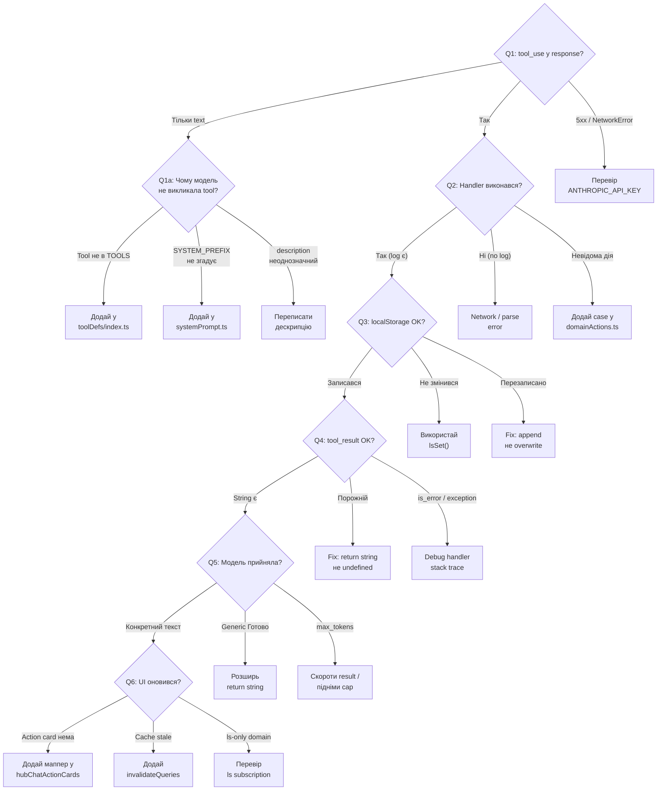

# Playbook: Debug HubChat Tool

**Trigger:** «Асистент каже що зробив, але нічого не сталось» / «Натиснув кнопку quick action — нема ефекту» / tool call повернувся текстом замість дії / `Невідома дія: …` у відповіді.

---

## Decision Tree

> Follow this tree from Q1 downward. Each leaf node (→ **ACTION**) links to the detailed steps below.

**Q1: Чи tool call дійшов до клієнта?**

- Network tab: response має `{ type: "tool_use", name: "...", input: {...} }` → перейди до Q2
- Response має тільки `{ type: "text" }` (модель не викликала tool) → перейди до Q1a
- Network error / 5xx → перевір `ANTHROPIC_API_KEY` у `.env` → [§1](#1-чи-tool-call-взагалі-дійшов-до-клієнта)

**Q1a: Чому модель не викликала tool?**

- Tool не у списку `TOOLS` (`apps/server/src/modules/chat/tools.ts`) → додай у `toolDefs/index.ts`
- `SYSTEM_PREFIX` не згадує tool (рядки 7–14 `systemPrompt.ts`) → додай згадку
- `description` у `toolDefs/<domain>.ts` неоднозначний → переписати імперативно з прикладом
- Все на місці → tune prompt → [tune-system-prompt.md](tune-system-prompt.md)

**Q2: Чи handler виконався на клієнті?**

- `console.log("executeAction", action)` з'явився → перейди до Q3
- Лог не з'явився → Network error або streaming parse failure → [§2](#2-чи-виконався-handler-на-клієнті)
- `Невідома дія: <name>` → case не додано у `chatActions/<domain>Actions.ts` або name mismatch (camelCase vs snake_case) → додай case

**Q3: Чи side effect (localStorage) записався?**

- Ключ записався коректно → перейди до Q4
- Ключ не змінився → handler не використовує `lsSet()` з `@shared/lib/storage` → [§3](#3-чи-правильний-side-effect-localstorage)
- Ключ перезаписаний (old data gone) → `lsSet(key, newItem)` замість `lsSet(key, [...prev, newItem])` → fix append logic

**Q4: Чи `tool_result` дійшов до моделі?**

- `tool_results[].content` містить інформативний string → перейди до Q5
- `tool_results[].content` порожній → handler повертає `undefined` замість `string` → fix return type → [§4](#4-чи-модель-отримала-tool_result)
- `is_error: true` у `tool_result` → handler кинув typed error → перевір stack trace
- `"Помилка виконання: …"` → handler кинув виняток → debug handler → [§4](#4-чи-модель-отримала-tool_result)

**Q5: Чи модель прийняла результат у фінальному тексті?**

- Текст згадує конкретний результат ("Залоговано 200 мл води") → проблема в UI → перейди до Q6
- Generic "Готово" → handler повертає занадто короткий result → розширь return string
- `stop_reason: "max_tokens"` → continuation cap (3×2500) → скороти `tool_result.content` або підніми `CHAT_MAX_TEXT_CONTINUATIONS`

**Q6: Чи UI оновився?**

- Action card не рендериться → `hubChatActionCards.ts` не покриває новий tool → додай маппер
- React Query cache stale → handler не викликає `queryClient.invalidateQueries` → додай invalidation
- localStorage-only домен (Routine, Fizruk) → компонент не re-render-ить → перевір subscription на ls changes

---

## Background (Original Steps)

### Контекст

HubChat tool execution path має 5 ланок (див. `AGENTS.md` → _Architecture: AI tool execution path_): user message → `/api/chat` (server pass-through) → Anthropic → `tool_use` блок → клієнтський `executeAction` → handler домену → `tool_result` → друге звернення до моделі. Зламатися може будь-яка з них; цей playbook — порядок локалізації.

Перед діагностикою:

- Відкрий DevTools → Console + Network → `/api/chat`.
- Включи логування у браузері: `localStorage.setItem("hubchat:debug", "1")` і перезавантаж сторінку (якщо фіча є; інакше додай локально `console.log` у потрібну точку).
- Перевір що `ANTHROPIC_API_KEY` справді є у `.env`. Без нього сервер віддає 500 і UI показує generic error.

### 1. Чи tool call взагалі дійшов до клієнта?

Подивись у Network на response **першого** `/api/chat` запиту (одразу після відправки user message).

Очікуваний JSON містить `content` масив з блоком `{ type: "tool_use", name: "<tool>", input: { … } }`. Якщо натомість тільки `{ type: "text", text: "…" }` — модель вирішила не викликати tool. Причини:

- `description` tool-а в `toolDefs/<domain>.ts` неоднозначний (модель вибрала text-відповідь).
- Tool взагалі не в списку `TOOLS` (`apps/server/src/modules/chat/tools.ts`) → перевір `toolDefs/index.ts`.
- `SYSTEM_PREFIX` (`systemPrompt.ts`) не згадує tool у списку рядки 7–14 → модель не знає, що він є.

→ Дій: підправ `description` (імперативно, з прикладом), переконайся що tool експортовано і доданий у `SYSTEM_PREFIX`. Деталі — `tune-system-prompt.md` і `add-hubchat-tool.md`.

### 2. Чи виконався handler на клієнті?

Постав `console.log("executeAction", action)` як перший рядок у `apps/web/src/core/lib/hubChatActions.ts`'s `executeAction`.

- Лог не з'явився → клієнт не отримав `tool_use`. Це NetworkError, або сервер віддав 5xx, або UI ще пробує парсити streamed response. Перевір Network response code.
- Лог є, але `Невідома дія: <name>` у `tool_result` → жоден `handle*Action` не повернув значення. Найчастіше: забули case у `apps/web/src/core/lib/chatActions/<domain>Actions.ts`, або `name` у tool def відрізняється від `name` у case (наприклад `findTransaction` vs `find_transaction`).

→ Дій: знайди файл `chatActions/<domain>Actions.ts` для свого домена, додай case з тим самим snake_case `name`, що й у tool def.

### 3. Чи правильний side effect (localStorage)?

DevTools → Application → Local Storage → знайди ключ свого домену (наприклад `nutrition_water_log_v1`, `finyk_transactions_v1`).

- Ключ не змінився після виклику → handler не записав. Перевір що ти використовуєш `lsSet(key, value)`, а не `localStorage.setItem` (anti-pattern #6 у `AGENTS.md` — race з cloud sync queue).
- Ключ записався, але старе значення зникло → ти зробив `lsSet(key, newItem)` замість `lsSet(key, [...prev, newItem])`. Завжди читай попереднє значення через `ls(key, default)` і додавай у масив.

→ Дій: handler пише через `ls`/`lsSet` з `@shared/lib/storage`. Якщо tool пише в API замість localStorage — перевір що використовується `@sergeant/api-client`, не fetch.

### 4. Чи модель отримала `tool_result`?

Дивись на **другий** `/api/chat` запит (continuation). У request body має бути масив повідомлень з `assistant` (raw tool_use блок) і `user` з `tool_results[].content`.

- `tool_results[].content` — порожній → handler повернув `undefined` замість рядка. Поверни `string` (правило з `add-hubchat-tool.md`).
- `tool_results[].content` — стрінговий error: `"Помилка виконання: …"` → handler кинув виняток. `executeAction` обгортає у такий рядок. Подивись `console.error` у тому ж handler-і, щоб побачити stack trace.
- `is_error: true` у `tool_result` → клієнт явно позначив помилку. Зазвичай це означає, що handler кинув typed error.

→ Дій: переконайся handler return-ить informative string, а не `void`. На помилку — кидай `Error("…")`, а не повертай порожній рядок (це втратить сигнал «щось не так» для моделі).

### 5. Чи модель прийняла результат у фінальному тексті?

Response **другого** `/api/chat` запиту повертає `{ type: "text", text: "…" }`. Перевір:

- Текст відповіді згадує результат tool-а («Залоговано 200 мл води») — все ок, проблема була не в pipeline, а у UI: action card / quick action не оновився, або `cloudsync` не синхронізував.
- Текст відповіді — generic «Готово» без конкретики → handler повернув занадто короткий результат. Розширь, додай числа з input-а у return string.
- `stop_reason: "max_tokens"` → continuation request обірвано на 2500 токенах (див. `AGENTS.md` → _max_tokens budget per request_). Сервер автоматично тягне auto-continuation до `MAX_TEXT_CONTINUATIONS=3` додаткових викликів (тільки якщо в `content` лише `text`, без `tool_use`), тож юзер у більшості випадків бачить склеєну повну відповідь. Якщо все одно обрізає — значить упёрлись у cap (3×2500 ≈ 7500 токенів виходу): або скороти `tool_result.content`/розбий запит, або тимчасово підніми `CHAT_MAX_TEXT_CONTINUATIONS` для відтворення.

### 6. Чи UI оновився?

Якщо handler виконався і модель повернула підтвердження, але користувач не бачить ефекту:

- `hubChatActionCards.ts` мапер не покриває новий tool → action card не відрендериться (теж не помилка, просто немає visual feedback).
- React Query cache не invalidate-нув → відкрий React Query DevTools, перевір ключ домену (наприклад `finykKeys.transactions`). Handler має після write викликати `queryClient.invalidateQueries`.
- localStorage-only домен (Routine, Fizruk) — UI читає з ls на render. Перевір що компонент дійсно re-render-ить (можливо, не передплачено зміни ls).

---

## Типові помилки

| Симптом                                                         | Корінь                                                         |
| --------------------------------------------------------------- | -------------------------------------------------------------- |
| `Невідома дія: foo`                                             | Case у `chatActions/<domain>Actions.ts` не додано              |
| Handler write успішний, але після reload даних нема             | `localStorage.setItem` замість `lsSet` → quota throw silently  |
| `tool_result.content` порожній → модель «зависла»               | Handler return undefined (TypeScript це не зловив через `any`) |
| Друге `/api/chat` обірвало JSON → parse error в `executeAction` | `stop_reason: "max_tokens"` на continuation (2500)             |
| Tool взагалі не викликається                                    | `SYSTEM_PREFIX` не згадує tool у списку рядки 7–14             |

---

## Verification

- [ ] Локалізовано конкретну ланку pipeline (1–6 вище), не «щось не так».
- [ ] Виправлення супроводжене юніт-тестом у `chatActions/<domain>Actions.test.ts` (happy path + error path) — щоб регресія не повернулась.
- [ ] Якщо причина у tool def — також оновлено `SYSTEM_PREFIX` (рядки 7–14).
- [ ] `pnpm --filter @sergeant/web exec vitest run src/core/lib/chatActions` — green.
- [ ] Smoke у HubChat після фіксу: повна відповідь моделі і відповідний action card.

## Notes

- Не шукай помилку в `chat.ts` без потреби. Сервер — тонкий pass-through; tool side effects там не виконуються (`AGENTS.md` Architecture). Реальні баги — у `chatActions/<domain>Actions.ts` або `toolDefs/<domain>.ts`.
- Якщо `executeAction` парсить tool input, обгорни доступ до полів у guard-и: модель може надіслати неповний об'єкт. Type assertion `(action as Foo).input` не безпечний.
- Для regression-перевірок використовуй mini-eval з `tune-system-prompt.md` крок 3.

## See also

- [add-hubchat-tool.md](add-hubchat-tool.md) — як додати tool правильно з нуля
- [tune-system-prompt.md](tune-system-prompt.md) — зміна системного промпту без поломки tool-calling
- [AGENTS.md](../../AGENTS.md) — секції _Architecture: AI tool execution path_, _max_tokens budget per request_, anti-pattern #6 про `localStorage.setItem`
- `apps/web/src/core/lib/hubChatActions.ts` — `executeAction` entry point
- `apps/server/src/modules/chat.ts` — `/api/chat` handler і continuation logic
