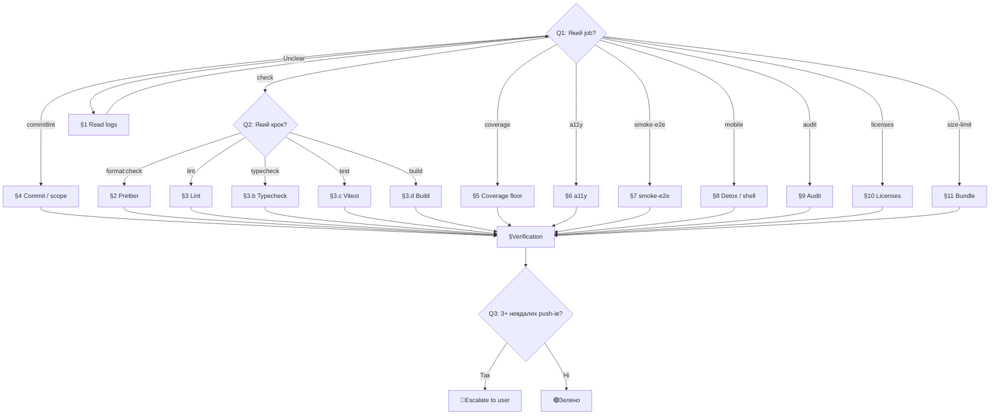

# Playbook: Fix Failing CI on a PR

> **Last validated:** 2026-04-28 by @Skords-01. **Next review:** 2026-07-28.
> **Status:** Active

**Trigger:** один або кілька CI-чеків червоні на відкритому PR (`commitlint`, `check`, `coverage`, `a11y`, `smoke-e2e`, Detox/mobile-shell, bundle-size, audit, license-check). НЕ для прод-інцидентів — для них див. [`hotfix-prod-regression.md`](hotfix-prod-regression.md).

---

## Decision Tree

> Follow this tree from Q1 downward. Each leaf node (→ **ACTION**) links to the detailed steps below.

**Q1: Який job червоний?**

- `commitlint` → [§4 Commit message / scope](#4-commitlint--commit-message--scope)
- `check` (`format:check`, `lint`, `typecheck`, `test`, `build` всередині нього) → перейди до Q2
- `coverage` → [§5 Coverage floor](#5-coverage--coverage-floor)
- `a11y` (Playwright + axe-core) → [§6 a11y](#6-a11y-axe-core)
- `smoke-e2e` (Playwright + real Postgres) → [§7 smoke-e2e](#7-smoke-e2e)
- Detox Android/iOS / mobile-shell — [§8 Mobile workflows](#8-detox--mobile-shell)
- `pnpm audit` (high) → [§9 Audit](#9-audit-exception-flow)
- `pnpm licenses:check` → [§10 Licenses](#10-licenses-check)
- `size-limit` (bundle) → [§11 Bundle budget](#11-bundle-size-budget)
- Незрозуміло / infra-flake → [§1 Прочитати логи](#1-прочитати-логи) → знову Q1

**Q2: Який саме крок `check`-job-а?**

- `format:check` → [§2 Prettier](#2-formatcheck--prettier) (часто — використати [`prettier-pass-on-docs.md`](prettier-pass-on-docs.md), якщо тільки docs)
- `lint` (eslint, import-checker, plugin tests) → [§3 Lint](#3-lint-eslint--imports--plugin-tests)
- `typecheck` (tsc) → [§3.b Typecheck](#3b-typecheck-tsc)
- `test` (vitest) → [§3.c Test](#3c-test-vitest)
- `build` (turbo) → [§3.d Build](#3d-build-turbo)

**Q3: Скільки разів я вже пушив фікс і CI знову червоний?**

- 0–2 → продовжуй цикл fix → push → recheck
- **3+** → **STOP** → ескалейт юзеру з: список червоних чеків, що вже спробував, виноска з логів, гіпотеза.



---

## Background (Original Steps)

### 1. Прочитати логи

```bash
git view_pr <repo> <pr_number>
git pr_checks <repo> <pr_number> wait_mode=none
git ci_job_logs <repo> <job_id>
```

Не вгадуй за назвою чека — більшість CI-фейлів мають 1–2 рядки root-cause-у в довгому лозі. `grep`-інь у завантаженому лозі.

### 2. `format:check` → prettier

Якщо тільки `docs/**` — використай [`prettier-pass-on-docs.md`](prettier-pass-on-docs.md).

В інших випадках:

```bash
pnpm exec prettier --check <path>            # подивитись
pnpm exec prettier --write <path>            # фіксити (тільки на торкнутих файлах)
```

Не запускай на всьому репо — це може зачепити несвідомо ignored / hand-formatted файли.

### 3. lint (eslint + imports + plugin tests)

```bash
pnpm lint                                    # full
pnpm --filter <pkg> exec eslint <path> --fix # точково
```

Окремі кроки lint-job:

- `pnpm lint:plugins` — кастомні rules в `packages/eslint-plugin-sergeant-design`.
- import-checker — `scripts/check-imports.*` (заборонені cross-package імпорти, raw `localStorage`, etc.).

Гарди, які часто впадають:

- `sergeant-design/no-raw-local-storage` — заміни на `ls`/`lsSet`/`safeReadLS`/`safeWriteLS`/`createModuleStorage` (AGENTS.md anti-pattern #6).
- `sergeant-design/rq-keys-only-from-factory` — використай factory з `apps/web/src/shared/lib/queryKeys.ts` (AGENTS.md rule #2).
- `sergeant-design/valid-tailwind-opacity` — лише дозволені кроки шкали (AGENTS.md rule #8).
- `sergeant-design/no-low-contrast-text-on-fill` — використай `*-strong` варіант кольору (AGENTS.md rule #9).
- `sergeant-design/ai-marker-syntax` — точно один із 5 префіксів (AGENTS.md § AI markers).

### 3.b typecheck (tsc)

```bash
pnpm typecheck                                  # all
pnpm --filter <pkg> exec tsc --noEmit           # точково
```

**Заборонено** глушити помилки через `any`, `@ts-ignore`, `@ts-expect-error`, `getattr/setattr`-style. Виправ типи реально.

### 3.c test (vitest)

```bash
pnpm --filter <pkg> exec vitest run <path>      # точково
pnpm test                                       # all
```

Перевір flaky-список ([CONTRIBUTING.md § Known flaky mobile tests](../../CONTRIBUTING.md#known-flaky-mobile-tests), [AGENTS.md § Pre-existing flaky tests](../../AGENTS.md#pre-existing-flaky-tests-do-not-block-merge)) — якщо червоний саме там і твій PR не чіпає `apps/mobile/**`, зробі retry job-а через UI **раз** перед тим як міняти код.

### 3.d build (turbo)

```bash
pnpm build                                       # all
pnpm --filter @sergeant/<pkg> build              # точково
```

Часто валиться через циклічну залежність або відсутній `exports` в `package.json`-і пакета. Подивись на конкретну помилку turbo — вона чітко вказує на пакет.

### 4. commitlint — commit message / scope

```bash
pnpm exec commitlint --last
pnpm exec commitlint --from origin/main --to HEAD
```

Часті проблеми:

- **Невідомий scope** (наприклад `mobile/core`, `app`, `monorepo`, `all`). Дозволені scope-и — лише ті, що в [AGENTS.md hard rule #5](../../AGENTS.md#5-conventional-commits-explicit-scope-enum). Якщо scope справді не покривається — додай новий **в одному PR** і в `AGENTS.md`, і в `commitlint.config.js`.
- **Невідомий type** — лише `feat`, `fix`, `docs`, `chore`, `refactor`, `perf`, `test`, `build`, `ci`.
- **Відсутність scope** — формат `<type>(<scope>): <subject>` обовʼязковий.

Фікс: запушити **новий** commit з виправленим message-ом (бажано `fix(<scope>): correct previous commit message`), не amend і не force-push (`AGENTS.md` rule #6).

### 5. coverage — coverage floor

```bash
pnpm test:coverage
```

Якщо CI каже про падіння під поріг — додай тести під торкнутий код (мета: повернутись на цифру до твого PR-у або вище). Не «тестуй тест, що тестує тест» — пиши тести з користю.

### 6. a11y (axe-core)

```bash
pnpm --filter @sergeant/web exec playwright install --with-deps chromium
pnpm --filter @sergeant/web a11y                  # або відповідний script
```

Часто фейлять: відсутній `aria-label` на кнопках без видимого тексту, низький контраст (див. AGENTS.md rule #9), відсутній `<label>` для `<input>`, неправильний heading order.

### 7. smoke-e2e

```bash
docker compose up -d postgres
pnpm --filter @sergeant/server db:migrate:dev
pnpm --filter @sergeant/server build && pnpm --filter @sergeant/server start &
pnpm --filter @sergeant/web build && pnpm --filter @sergeant/web preview &
pnpm --filter @sergeant/web e2e                   # або відповідний script
```

Перевір логи Postgres (`docker logs <pg>`), серверні логи (стдаут), і Playwright trace.

### 8. Detox / mobile-shell

Окремі workflow-и для `apps/mobile` (Expo Detox iOS/Android) і `apps/mobile-shell` (Capacitor Android/iOS). Якщо твій PR не чіпає `apps/mobile/**` або `apps/mobile-shell/**` — це майже завжди infra-flake; перезапусти job через UI. Якщо чіпає — читай Detox-репорт + ілеустрації артефактів.

### 9. Audit (`pnpm audit --audit-level=high`)

Дотримуйся [`CONTRIBUTING.md` § Audit exception workflow](../../CONTRIBUTING.md#audit-exception-workflow):

1. Задокументуй вразливість у [`docs/security/audit-exceptions.md`](../security/audit-exceptions.md) (advisory, package, severity, mitigation, due, owner).
2. Додай label `audit-exception` до PR — це скіпає high-severity audit-кроки, але не critical.
3. Видали label, коли вразливість закрита.

### 10. licenses-check

```bash
pnpm licenses:check
# зазвичай треба регенерувати:
pnpm licenses:generate                            # перевір реальну назву script-а
git add THIRD_PARTY_LICENSES.md
```

Закомітити в **тому ж** PR, де зміна lock-файлу.

### 11. bundle size budget

`apps/web` JS ≤ 615 kB brotli, CSS ≤ 18 kB brotli (AGENTS.md § Performance budgets, CONTRIBUTING.md § Performance budgets).

```bash
pnpm --filter @sergeant/web exec size-limit
pnpm --filter @sergeant/web build && pnpm --filter @sergeant/web exec size-limit --json
```

Опції:

- Видалити випадковий import, що тягне велику бібліотеку (динамічний імпорт замість статичного).
- Розбити route-bundle через `React.lazy`.
- Якщо ріст обґрунтований — підняти бюджет у `apps/web/package.json` → `size-limit`, з поясненням у PR-body.

---

## Verification

- [ ] Усі required-чеки на PR — зелені.
- [ ] Жодних `--no-verify`, `--amend`, force-push шерех-гілки (`AGENTS.md` rule #6, #7).
- [ ] У фікс-комітах **тільки** релевантні для CI-фейлу зміни.
- [ ] Якщо знадобився `audit-exception` — entry додано в `docs/security/audit-exceptions.md` із due-date.
- [ ] commit messages — Conventional Commits з scope із AGENTS.md rule #5.
- [ ] Якщо було 3+ невдалих push-и — користувача **повідомлено**, а не тиха ескалація.

## Notes

- Логи > здогадки. Вживай `git ci_job_logs job_id=<id>` і читай повністю.
- Failures often cluster — фікси root-cause, а не симптом.
- Flaky retry — **раз**, не нескінченно.
- Якщо тести почали падати після dep-bump-у — окремий PR з фіксом, не змішувати з твоєю фічею (AGENTS.md soft rule).
- Не міняй тести, щоб вони стали зеленими, без явного запиту користувача.

## See also

- [hotfix-prod-regression.md](hotfix-prod-regression.md) — для прод-інцидентів (інша decision-tree).
- [stabilize-flaky-test.md](stabilize-flaky-test.md) — якщо зрозуміло, що це справжня flake.
- [bump-dep-safely.md](bump-dep-safely.md) — якщо CI впав через dep-bump.
- [pre-merge-migration-checklist.md](pre-merge-migration-checklist.md) — якщо PR із міграцією.
- [prettier-pass-on-docs.md](prettier-pass-on-docs.md) — точковий prettier-fix для `docs/**`.
- [AGENTS.md](../../AGENTS.md) — rules #5 (scope enum), #6 (no force-push), #7 (no `--no-verify`).
- [CONTRIBUTING.md § CI Pipeline](../../CONTRIBUTING.md#ci-pipeline) — повний перелік jobs.
