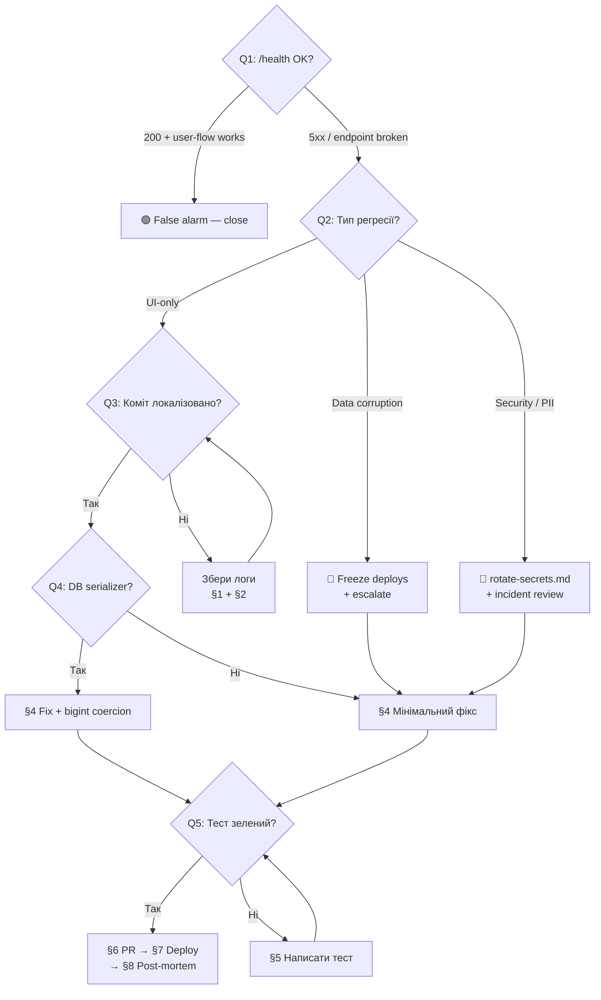

# Playbook: Hotfix Production Regression

> **Last validated:** 2026-04-27 by @Skords-01. **Next review:** 2026-06-26.

**Trigger:** "Прод впав" / користувачі скаржаться / HTTP 500 на `/health` / Sentry alert / Railway logs показують panic.

---

## Decision Tree

> Follow this tree from Q1 downward. Each leaf node (→ **ACTION**) links to the detailed steps below.

**Q1: Чи підтверджено що прод дійсно зламаний?**

- `/health` повертає 200 і юзер-флоу працює → **STOP** — false alarm, задокументуй і закрий
- `/health` повертає 5xx або конкретний endpoint зламано → перейди до Q2

**Q2: Який тип регресії?**

- UI-only (no data corruption, cosmetic / JS error) → перейди до Q3
- Data corruption suspected (неправильні суми, зникли записи) → **STOP** → freeze deploys + ескалейт мейнтейнеру → див. [§3 Hotfix branch](#3-створити-hotfix-гілку-від-main) + [§8 Post-mortem](#8-post-mortem-note)
- Security incident (PII leak, unauthorized access) → **STOP** → [rotate-secrets.md](rotate-secrets.md) + інцидент-рев'ю → потім повернись до [§4 Мінімальний фікс](#4-мінімальний-фікс)

**Q3: Чи вдалось локалізувати коміт?**

- Так, конкретний коміт знайдено через `git log` / `git bisect` → перейди до Q4
- Ні, стектрейс / логи незрозумілі → зібрати додаткову інформацію ([§1](#1-підтвердити-симптом), [§2](#2-локалізувати-причину)) → повтори Q3

**Q4: Чи фікс стосується DB serializer?**

- Так → обов'язково перевірити bigint→number coercion (AGENTS.md rule #1) → [§4](#4-мінімальний-фікс)
- Ні → [§4](#4-мінімальний-фікс)

**Q5: Чи тест написаний і зелений?**

- Так → [§6 Fast-track PR](#6-fast-track-pr-review) → [§7 Deploy](#7-deploy-через-railway) → [§8 Post-mortem](#8-post-mortem-note)
- Ні → повернись до [§5](#5-написати-тест-що-відтворює-регресію)



---

## Background (Original Steps)

### 1. Підтвердити симптом

```bash
# Перевірити health endpoint
curl -sS https://<prod-domain>/health | jq .

# Railway logs (останні 100 рядків)
railway logs --tail 100

# Sentry (якщо налаштовано) — відкрити dashboard, знайти останній unresolved issue
```

Зафіксувати: що саме зламалось, коли почалось, кого стосується (всі / конкретний endpoint / один юзер).

### 2. Локалізувати причину

```bash
# Які коміти потрапили в прод з моменту коли все працювало?
git log --oneline main~10..main

# Пошук по логам / стектрейсах
grep -rn "<error_keyword>" apps/server/src/
```

Визначити конкретний коміт або файл що викликав регресію.

### 3. Створити hotfix-гілку від `main`

```bash
git checkout main && git pull origin main
git checkout -b devin/<unix-ts>-hotfix-<short-desc>
```

- Гілка **завжди** від `main` (не від feature-branch).
- Ніяких `--force-push` (AGENTS.md rule #6).

### 4. Мінімальний фікс

- Тільки те що потрібно щоб прибрати регресію. Ніяких "while we're here" рефакторингів.
- Conventional commit: `fix(<scope>): <що саме виправлено>` (AGENTS.md rule #5).
- Якщо фікс стосується DB serializer — перевірити bigint→number coercion (AGENTS.md rule #1).

### 5. Написати тест що відтворює регресію

```bash
# Створити або оновити тест що падає БЕЗ фіксу і проходить З фіксом
pnpm --filter <package> exec vitest run <path-to-test>
```

Тест **обов'язковий** — без нього PR не мерджити. Тест має:

- Відтворювати точний сценарій що зламався.
- Проходити з фіксом.
- Падати якщо фікс відкатити (red-green перевірка).

### 6. Fast-track PR review

```bash
pnpm lint       # має бути зеленим
pnpm typecheck  # має бути зеленим
```

- PR title: `fix(<scope>): hotfix — <short description>`
- PR description: що зламалось, root cause, як відтворити, що фікснуто.
- Label: `hotfix` (якщо є).
- Reviewer: мейнтейнер або on-call.

### 7. Deploy через Railway

Після merge в `main`:

- Railway автоматично деплоїть (або тригернути вручну через Railway dashboard).
- Pre-deploy: `pnpm db:migrate` (якщо були міграції).
- Перевірити `/health` endpoint після деплою.

```bash
curl -sS https://<prod-domain>/health | jq .
```

### 8. Post-mortem note

Створити `docs/postmortems/YYYY-MM-DD-<short-desc>.md` з:

- **Що сталось** — симптоми з кроку 1.
- **Root cause** — що знайшли у кроці 2.
- **Fix** — посилання на PR.
- **Timeline** — коли зламалось → коли помітили → коли пофіксили.
- **Prevention** — який тест / CI check / lint rule запобіг би цьому.

---

## Verification

- [ ] `/health` повертає 200 на проді
- [ ] Sentry issue resolved (якщо був)
- [ ] `pnpm lint` — green
- [ ] `pnpm typecheck` — green
- [ ] Тест що відтворює регресію — green
- [ ] Post-mortem note створено

## Notes

- **Ніяких force push** до `main` — AGENTS.md rule #6.
- **Conventional commits** — `fix(scope): ...` — AGENTS.md rule #5.
- **Husky pre-commit** — не skip-увати (`--no-verify` заборонено) — AGENTS.md rule #7.
- Flaky mobile-тести (`OnboardingWizard`, `WeeklyDigestFooter`, `HubSettingsPage`) не блокують merge — AGENTS.md.
- Якщо регресія в DB serializer — обов'язково перевірити bigint→number coercion ([#708](https://github.com/Skords-01/Sergeant/issues/708)).

## See also

- [AGENTS.md](../../AGENTS.md) — hard rules
- [monobank-webhook-migration.md](../monobank-webhook-migration.md) — якщо регресія пов'язана з Monobank webhook pipeline
- [cleanup-dead-code.md](cleanup-dead-code.md) — якщо hotfix виявить мертвий код що заважав
