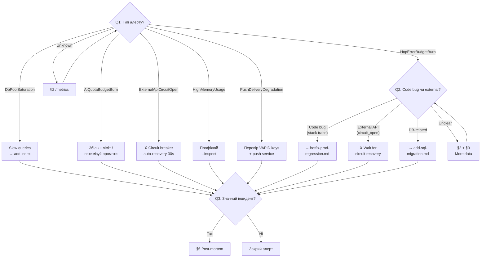

# Playbook: Investigate Alert

**Trigger:** Prometheus alert спрацював / Sentry повідомлення / підозрілі 5xx у логах / деградація `/health`.

---

## Decision Tree

> Follow this tree from Q1 downward. Each leaf node (→ **ACTION**) links to the detailed steps below.

**Q1: Який тип алерту?**

- `HttpErrorBudgetBurn` (5xx spike) → перейди до Q2
- `DbPoolSaturation` → **ACTION**: перевір slow queries, додай індекс → [§4 DB saturated](#4-класифікувати-root-cause)
- `AiQuotaBudgetBurn` → **ACTION**: збільш ліміт або оптимізуй промпти → [§4 AI quota](#4-класифікувати-root-cause)
- `PushDeliveryDegradation` → перевір VAPID keys + push service status → [§4](#4-класифікувати-root-cause)
- `ExternalApiCircuitOpen` → **WAIT**: circuit breaker auto-recovery (30s) → якщо не відновилось → [§5 Ескалація](#5-виправити-або-ескалувати)
- `HighMemoryUsage` → перевір RSS trend → профілюй з `--inspect` → [§5](#5-виправити-або-ескалувати)
- Невідомий / інший → [§2 Перевір /metrics](#2-перевірити-metrics) → повтори Q1

**Q2: 5xx — це code bug чи зовнішня залежність?**

- Stack trace вказує на конкретний path у `apps/server/` → **Code bug** → [hotfix-prod-regression.md](hotfix-prod-regression.md)
- `circuit_open` outcome для зовнішнього API (Mono, Anthropic) → **External** → circuit breaker auto-recovery, чекай
- DB-related (pool exhaustion, slow queries) → [add-sql-migration.md](add-sql-migration.md) для індексу / оптимізації
- Незрозуміло → збери більше даних: [§2 /metrics](#2-перевірити-metrics) + [§3 Pino логи](#3-перевірити-pino-логи) → повтори Q2

**Q3: Чи інцидент значний (downtime > 5 хв / data loss / user impact)?**

- Так → обов'язковий post-mortem → [§6 Документувати](#6-документувати)
- Ні → задокументуй у логі, закрий алерт



---

## Background (Original Steps)

### 1. Визначити тип алерту

Відкрити `docs/observability/runbook.md` і знайти відповідний розділ:

| Алерт                     | Що горить                                     |
| ------------------------- | --------------------------------------------- |
| `HttpErrorBudgetBurn`     | Сплеск 5xx responses                          |
| `DbPoolSaturation`        | DB connection pool заповнений                 |
| `AiQuotaBudgetBurn`       | AI-запити перевищують квоту                   |
| `PushDeliveryDegradation` | Push-нотифікації не доставляються             |
| `ExternalApiCircuitOpen`  | Circuit breaker відкрився для зовнішнього API |
| `HighMemoryUsage`         | Memory leak або spike                         |

### 2. Перевірити /metrics

```bash
# Prometheus метрики
curl -H "Authorization: Bearer $METRICS_TOKEN" https://<prod>/metrics

# Ключові метрики для 5xx:
# http_requests_total{status=~"5.."}
# app_errors_total{kind,status,code,module}
# external_http_requests_total{upstream,outcome}
```

### 3. Перевірити Pino логи

```bash
# Railway logs (JSON, Pino format)
railway logs --tail 200 | jq 'select(.level >= 50)'

# Фільтрувати по module
railway logs --tail 200 | jq 'select(.module == "<module>")'

# Шукати конкретну помилку
railway logs --tail 500 | jq 'select(.err != null) | {time, module, msg, err: .err.message}'
```

Кожен лог-запис має ALS-контекст: `requestId`, `userId`, `module`.

### 4. Класифікувати root cause

| Категорія             | Ознаки                                        | Дії                                                      |
| --------------------- | --------------------------------------------- | -------------------------------------------------------- |
| DB saturated          | `db_pool_waiting` високий, повільні queries   | Перевірити slow queries, можливо потрібен індекс         |
| External API down     | `circuit_open` outcome, timeouts              | Нічого не робити — circuit breaker захищає; чекати       |
| Code bug (regression) | Конкретний path + stack trace                 | → [hotfix-prod-regression.md](hotfix-prod-regression.md) |
| AI quota exceeded     | `ai_requests_total{outcome="quota_exceeded"}` | Збільшити ліміт або оптимізувати prompts                 |
| Memory leak           | Зростаючий RSS, OOMKilled у Railway           | Профілювати з `--inspect`, знайти leak                   |
| Rate limit (Monobank) | 429 у логах для mono upstream                 | Очікувано — rate limit 1 req/60s/token                   |

### 5. Виправити або ескалувати

- **Якщо code bug** → слідуй [hotfix-prod-regression.md](hotfix-prod-regression.md).
- **Якщо external API** → зачекай, circuit breaker автоматично відновиться через `resetTimeout` (30s).
- **Якщо DB** → додай індекс або оптимізуй query → [add-sql-migration.md](add-sql-migration.md).
- **Якщо незрозуміло** → ескалуй до мейнтейнера з зібраними даними.

### 6. Документувати

Якщо інцидент значний (downtime > 5 хв, data loss, user impact):

- Створити `docs/postmortems/YYYY-MM-DD-<short-desc>.md`
- Timeline: алерт → виявлено → пофіксено → verified
- Root cause
- Prevention: який тест / моніторинг запобіг би

---

## Verification

- [ ] Root cause визначено
- [ ] `/health` повертає 200
- [ ] Алерт resolved (метрики повернулись до норми)
- [ ] Фікс задеплоєно (якщо code bug)
- [ ] Post-mortem створено (якщо значний інцидент)

## Notes

- **Не панікуй** — circuit breaker і retry захищають від більшості transient failures.
- Pino логи — JSON у stdout. Використовуй `jq` для фільтрації.
- `METRICS_TOKEN` потрібен для доступу до `/metrics` endpoint.
- Sentry ловить `fatal`/`error` рівні включно з `err.cause` chain.
- Flaky external APIs (Monobank, Anthropic) — очікувана поведінка, circuit breaker повинен справлятись.

## See also

- [observability/runbook.md](../observability/runbook.md) — повний runbook для кожного типу алерту
- [observability/SLO.md](../observability/SLO.md) — SLO визначення та бюджети
- [observability/dashboards.md](../observability/dashboards.md) — Grafana dashboards
- [hotfix-prod-regression.md](hotfix-prod-regression.md) — якщо root cause = code bug
- [AGENTS.md](../../AGENTS.md) — deployment та health endpoint
