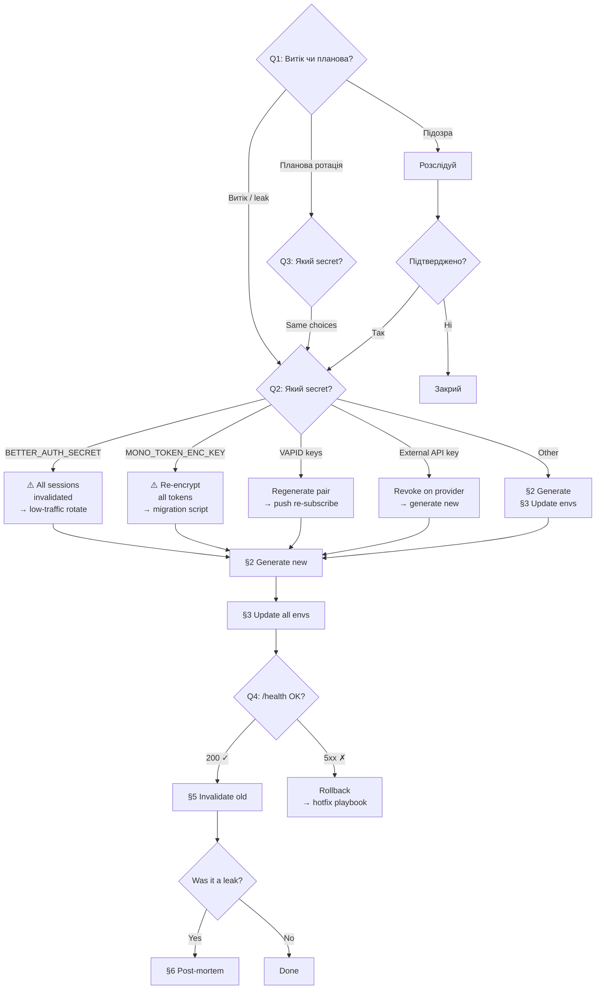

# Playbook: Rotate Secrets

> **Last validated:** 2026-04-27 by @Skords-01. **Next review:** 2026-06-26.
> **Status:** Active

**Trigger:** "Secret leaked" / планова ротація / security audit / підозріла активність.

---

## Decision Tree

> Follow this tree from Q1 downward. Each leaf node (→ **ACTION**) links to the detailed steps below.

**Q1: Це витік чи планова ротація?**

- Витік (secret з'явився у логах / git history / public) → **URGENT** → перейди до Q2
- Планова ротація / security audit → перейди до Q3
- Підозріла активність (незвичайні запити, unknown sessions) → розслідуй спочатку → якщо підтверджено витік → Q2, якщо false alarm → закрий

**Q2: Який secret скомпрометовано?**

- `BETTER_AUTH_SECRET` → **WARNING**: всі сесії стануть невалідними → ротація в low-traffic час → [§2 Generate](#2-згенерувати-новий-secret) → [§3 Update envs](#3-оновити-secret-у-середовищах) → [§5 Invalidate old](#5-інвалідувати-старий-secret)
- `MONO_TOKEN_ENC_KEY` → **COMPLEX**: потрібна re-encryption всіх `mono_connection.token_ciphertext` → окремий migration script → [§2](#2-згенерувати-новий-secret) → [§3](#3-оновити-secret-у-середовищах) → [§5](#5-інвалідувати-старий-secret)
- `VAPID_*` keys → regenerate pair → [§2](#2-згенерувати-новий-secret) → всі push-підписки стануть невалідними (юзери re-subscribe)
- External API key (Anthropic, Resend, Sentry) → revoke на dashboard провайдера → [§2](#2-згенерувати-новий-secret) → [§3](#3-оновити-secret-у-середовищах)
- Інший secret → [§2](#2-згенерувати-новий-secret) → [§3](#3-оновити-secret-у-середовищах)

**Q3: Який secret ротується?**

- Той самий вибір що у Q2 (без urgent pressure) → відповідний шлях з Q2

**Q4: Чи `/health` повертає 200 після оновлення?**

- Так → [§5 Invalidate old](#5-інвалідувати-старий-secret) → якщо витік → [§6 Post-mortem](#6-post-mortem-якщо-leak)
- Ні → відкат до старого secret, debug → [hotfix-prod-regression.md](hotfix-prod-regression.md)



---

## Background (Original Steps)

### 1. Оцінити scope витоку

- Який secret скомпрометовано?
- Де він використовується? (Railway env, CI secrets, `.env` файли)
- Чи є ознаки зловживання? (логи, Sentry, незвичайні запити)

### 2. Згенерувати новий secret

```bash
# Для загальних secrets (BETTER_AUTH_SECRET, etc.)
openssl rand -hex 32

# Для VAPID keys
pnpm exec web-push generate-vapid-keys

# Для Monobank webhook secret (per-user, зберігається в DB)
# Це server-side — потребує код-зміну якщо ротація всіх юзерів
```

### 3. Оновити secret у середовищах

**Railway (Production):**

1. Відкрити Railway dashboard → Service → Variables
2. Оновити значення змінної
3. Railway автоматично перезапустить сервіс

**GitHub Actions (CI):**

1. Settings → Secrets and variables → Actions
2. Оновити відповідний secret

**Локальна розробка:**

1. Оновити `.env` файл (НЕ комітити!)
2. Оновити `.env.example` якщо формат secret-а змінився

### 4. Перевірити `/health` endpoint

```bash
# Після того як Railway передеплоїть
curl -sS https://<prod-domain>/health | jq .
```

Переконатись що сервіс стартанув з новим secret-ом без помилок.

### 5. Інвалідувати старий secret

- Якщо це API key зовнішнього сервісу — revoke через dashboard провайдера (Anthropic, Resend, Sentry тощо).
- Якщо це `BETTER_AUTH_SECRET` — всі існуючі сесії стануть невалідними (юзерам треба буде re-login).
- Якщо це Monobank `MONO_TOKEN_ENC_KEY` — потрібна re-encryption всіх збережених токенів.

### 6. Post-mortem (якщо leak)

Якщо secret витік (а не планова ротація):

- Створити `docs/postmortems/YYYY-MM-DD-secret-rotation.md`
- Описати: що витекло, як, timeline, impact, prevention.

---

## Verification

- [ ] Новий secret встановлено у всіх середовищах (Railway, CI, local)
- [ ] `/health` — 200
- [ ] Старий secret інвалідовано
- [ ] `.env.example` оновлено (якщо формат змінився)
- [ ] Логи не містять нових помилок автентифікації
- [ ] Post-mortem створено (якщо leak)

## Notes

- **НІКОЛИ** не комітити secrets у git (навіть тимчасово).
- `BETTER_AUTH_SECRET` ротація = всі сесії інвалідуються. Робити в low-traffic час.
- `MONO_TOKEN_ENC_KEY` ротація — найскладніша, потребує re-encrypt всіх `mono_connection.token_ciphertext`. Окремий migration script.
- Railway Variables з типом «Reference» (`${{ Postgres.DATABASE_URL }}`) — змінюються автоматично при зміні DB credentials.

## See also

- [railway-vercel.md](../integrations/railway-vercel.md) — список env vars для Railway
- [AGENTS.md](../../AGENTS.md) — ніколи не комітити credentials
- [hotfix-prod-regression.md](hotfix-prod-regression.md) — якщо ротація зламала прод
