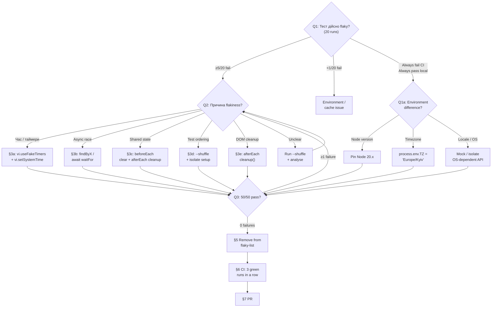

# Playbook: Stabilize Flaky Test

> **Last validated:** 2026-04-27 by @Skords-01. **Next review:** 2026-07-26.
> **Status:** Active

**Trigger:** «Тест X падає 1 з 5 разів» / у CI red, локально green / тест у списку **«Pre-existing flaky tests»** в AGENTS.md.

---

## Decision Tree

> Follow this tree from Q1 downward. Each leaf node (→ **ACTION**) links to the detailed steps below.

**Q1: Чи тест дійсно flaky?**

- Падає ≥5 з 20 локальних ранів → **Так, flaky** → перейди до Q2
- Падає < 1 з 20 → скоріш за все environment-залежне (Node version, кеш) → перевір env differences
- **Завжди** падає у CI, **завжди** проходить локально → **Environment difference** (не flaky) → перейди до Q1a

**Q1a: Яка environment difference?**

- Node version (CI = 20.x, local інша) → pin Node version
- Timezone (CI = UTC, local = Europe/Kyiv) → `process.env.TZ = "Europe/Kyiv"` у тесті
- Locale / OS → ізолюй залежне API → [§3e DOM cleanup](#3e-dom-cleanup) або mock

**Q2: Яка причина flakiness?**

- Час / таймери (`Date.now()`, `setTimeout` без `vi.useFakeTimers()`) → [§3a](#3a-час--таймери)
- Async без await (`fireEvent.click` → assertion перед promise resolved) → [§3b](#3b-async-race)
- Shared state між тестами (localStorage / MMKV / mocks not cleared) → [§3c](#3c-shared-state)
- Залежність від порядку тестів (test A leaves state for test B) → [§3d](#3d-test-ordering)
- DOM cleanup (multiple `render()` без `cleanup`) → [§3e](#3e-dom-cleanup)
- Незрозуміло → запусти з `--sequence.shuffle` і дивись [§2](#2-класифікуй-причину-flakiness) → повтори Q2

**Q3: Чи фікс пройшов 50/50 ранів?**

- Так (0 failures з 50) → [§5 Видали з flaky-list](#5-видали-з-flaky-list) → [§6 CI smoke](#6-ci-smoke) → [§7 PR](#7-pr)
- Ні (≥1 failure) → повернись до Q2, копай глибше



---

## Background (Original Steps)

### Контекст

Sergeant має 3 відомі flaky тести у `apps/mobile` (зафіксовано в AGENTS.md):

- `apps/mobile/src/core/OnboardingWizard.test.tsx`
- `apps/mobile/src/core/dashboard/WeeklyDigestFooter.test.tsx`
- `apps/mobile/src/core/settings/HubSettingsPage.test.tsx`

Вони падають у CI на `main`, але не блокують merge — це by design, поки їх не стабілізували. Якщо береш flaky — мета **видалити з AGENTS.md flaky-list**, а не тимчасово приховати.

### 1. Підтверди flakiness емпірично

Запусти тест **20 разів** локально й порахуй failures:

```bash
for i in {1..20}; do
  pnpm --filter @sergeant/mobile exec vitest run src/core/OnboardingWizard.test.tsx --reporter=basic 2>&1 | tail -1 || echo "RUN $i: FAIL"
done | grep FAIL | wc -l
```

Якщо < 1 з 20 — скоріш за все environment-залежне (Node version, кеш). Якщо 5+ з 20 — справжня flakiness.

Якщо тест **завжди** падає у CI і **завжди** проходить локально — це **environment differences**, не flaky. Перевір Node version (CI = 20.x), часовий пояс runner-а, locale. Це окремий жанр, фікс простіший: задізолюй те, що відрізняється.

### 2. Класифікуй причину flakiness

Топ-5 причин (порядок ймовірності):

1. **Час / таймери.** `Date.now()`, `setTimeout` без `vi.useFakeTimers()`, race на `await waitFor`.
2. **Async без await.** `fireEvent.click(button)` повертає void, але внутрі є promise — наступний assertion видно стейт «до».
3. **Shared state між тестами.** `localStorage` / MMKV не очищується. Mock не сброшується (`vi.clearAllMocks` не викликано).
4. **Залежність від порядку тестів.** Test A залишає state, Test B очікує fresh state. Vitest `--shuffle` робить це видимим.
5. **DOM cleanup.** Кілька `render()` в одному тесті без `cleanup` між ними. Result: дублі `data-testid`.

Для кожної причини — конкретні fix-патерни нижче.

### 3. Fix patterns

#### 3a. Час / таймери

```ts
// ❌ Залежить від реального часу — flaky
const today = new Date();
expect(screen.getByText(today.toLocaleDateString())).toBeVisible();

// ✅ Заморозь час
beforeEach(() => {
  vi.useFakeTimers();
  vi.setSystemTime(new Date("2026-04-25T12:00:00+03:00")); // Kyiv time!
});
afterEach(() => vi.useRealTimers());
```

Для Kyiv-day boundary (AGENTS.md domain invariants) — мокай **Kyiv-час** конкретно, бо UTC-час о 22:00 — це вже наступний день у Kyiv.

#### 3b. Async race

```ts
// ❌ Race
fireEvent.click(submitButton);
expect(screen.getByText("Збережено")).toBeVisible();

// ✅ Wait
fireEvent.click(submitButton);
await waitFor(() => {
  expect(screen.getByText("Збережено")).toBeVisible();
});

// ✅ Або use userEvent (асинхронний)
const user = userEvent.setup();
await user.click(submitButton);
expect(await screen.findByText("Збережено")).toBeVisible();
```

`findByX` (асинхронний get) майже завжди безпечніший за `getByX` для post-action assertions.

#### 3c. Shared state

```ts
// vitest.config: setupFiles вже може містити global cleanup, перевір.
// Локально для конкретного тесту:

import { afterEach, beforeEach } from "vitest";
import { cleanup } from "@testing-library/react";

beforeEach(() => {
  localStorage.clear();
  // mobile:
  // require("@react-native-async-storage/async-storage").default.clear();
});

afterEach(() => {
  cleanup(); // unmount + remove from document
  vi.clearAllMocks();
});
```

#### 3d. Test ordering

Vitest за замовчуванням пускає файли паралельно, тести всередині — sequentially. Але якщо тести діляться module-scope state, ордер всередині файлу матиме значення.

Запусти зі shuffle, щоб виявити приховану залежність:

```bash
pnpm --filter @sergeant/mobile exec vitest run src/core/OnboardingWizard.test.tsx --sequence.shuffle
```

Якщо падає по-новому — є залежність. Винеси setup у `beforeEach`, не в module top-level.

#### 3e. DOM cleanup

```ts
// ❌ Multiple render без cleanup → "Found multiple elements by [data-testid='x']"
it("test 1", () => { render(<App />); ... });
it("test 2", () => { render(<App />); /* test 1 still in DOM */ });

// ✅ Cleanup hook
import { cleanup } from "@testing-library/react";
afterEach(() => cleanup());
```

(Це fix-причина у `ChatQuickActions.test.tsx` під час quick-actions PR — див. контекст у [#743](https://github.com/Skords-01/Sergeant/pull/743).)

### 4. Verify fix

Запусти 50 разів:

```bash
for i in {1..50}; do
  pnpm --filter @sergeant/mobile exec vitest run src/core/OnboardingWizard.test.tsx --reporter=basic 2>&1 \
    | grep -qE "Tests.*\d+ passed" && echo "RUN $i: pass" || echo "RUN $i: FAIL"
done | grep FAIL | wc -l
```

**Acceptance:** 0 failures з 50. Якщо 1 з 50 — продовжуй копати, не мерж.

### 5. Видали з flaky-list

Після того, як 50/50 — оновлення в `AGENTS.md`:

```diff
 ## Pre-existing flaky tests (do not block merge)

-- `apps/mobile/src/core/OnboardingWizard.test.tsx`
 - `apps/mobile/src/core/dashboard/WeeklyDigestFooter.test.tsx`
 - `apps/mobile/src/core/settings/HubSettingsPage.test.tsx`
```

Це **обов'язкова частина PR-у** — інакше наступний агент не знатиме, що тест уже стабілізований, і знов спишеть падіння на «known flaky».

### 6. CI smoke

Push, побач 3 послідовних зелених CI run-и для `Test coverage (vitest)` job. Якщо хоч один зелений-зелений-червоний — фікс не доведений, треба ще копати.

### 7. PR

Branch: `devin/<unix-ts>-fix-flaky-<test-name>`. Commit:

```
fix(mobile): stabilize OnboardingWizard flaky test

Root cause: Date.now() used for stepStartedAt assertion; non-deterministic
in CI when test runs slow.

Fix:
- mock vi.useFakeTimers in beforeEach
- assert relative time delta, not absolute timestamp
- add cleanup hook for DOM (was missing)

Verified: 50/50 runs locally pass; AGENTS.md flaky-list trimmed.
```

---

## Verification

- [ ] Підтверджено flakiness емпірично (≥ 5 з 20 ранів падає до фіксу).
- [ ] Знайдено root cause (одна з 5 категорій з кроку 2).
- [ ] Застосовано відповідний fix-pattern (`fakeTimers`, `findByX`, `cleanup`, etc.).
- [ ] **50 з 50** локальних ранів зелені після фіксу.
- [ ] AGENTS.md flaky-list оновлений (тест видалено).
- [ ] CI: 3 послідовних зелених `Test coverage (vitest)` runs.
- [ ] `pnpm lint` + `pnpm typecheck` — green.

## Notes

- **Не маскуй flakiness через `it.skip`** і не додавай `retry: 3` локально для тесту. Це лише ховає, не фіксить.
- **Mobile-specific:** `vi.useFakeTimers` працює, але Hermes runtime іноді поводиться інакше за Node — перевір що тест використовує `vitest` env, не `node:test`.
- Якщо корінь проблеми — **компонент**, а не тест (race у `useEffect`, що депендиться від render order) — фікс у компоненті, не в тесті. Тест-фікс перетворює тест на placeholder.
- Якщо падіння **environment-only** (CI Linux vs локальний macOS) — задізолюй timezone і locale у тесті:
  ```ts
  process.env.TZ = "Europe/Kyiv";
  ```

## See also

- [AGENTS.md](../../AGENTS.md) — секція «Pre-existing flaky tests»
- [#743](https://github.com/Skords-01/Sergeant/pull/743) — приклад DOM-cleanup fix у `ChatQuickActions.test.tsx`
- [hotfix-prod-regression.md](hotfix-prod-regression.md) — якщо це не flaky, а справжня регресія
